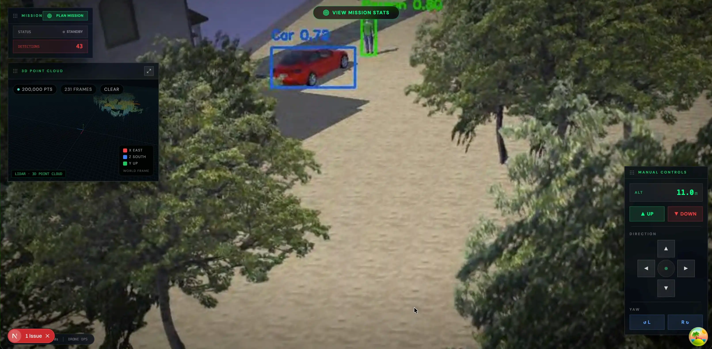
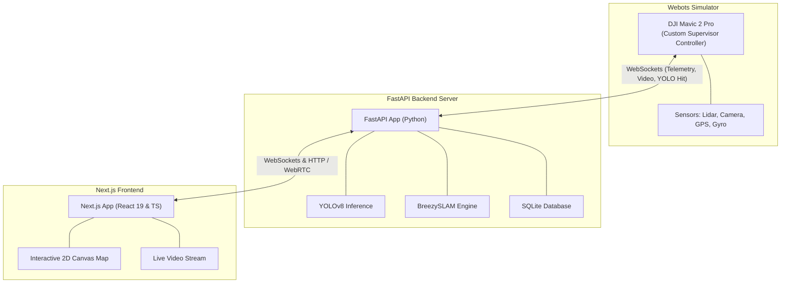
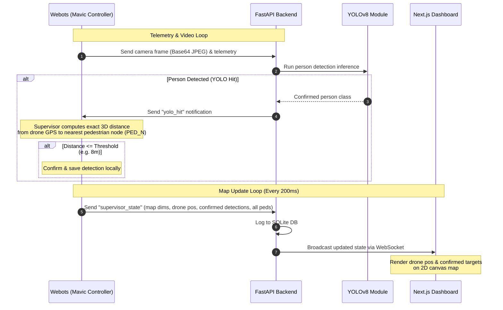

# 🚁 Autonomous Flood Rescue Drone Simulation

An autonomous search-and-rescue (SAR) system designed to detect and locate stranded individuals in a simulated flood disaster scenario. Using **Webots** for physics-based flight simulation of a DJI Mavic 2 Pro, **FastAPI** for real-time telemetry processing, SLAM mapping, and YOLO-based computer vision, and a modern **Next.js** dashboard for remote live tracking.



---

## 🏗️ System Architecture & Tech Stack

The system is split into three main components that communicate in real-time over WebSockets and HTTP:




### 1. 🎛️ Simulation & Robot Controller (`mavic/`)
* **Simulator**: Webots (using a DJI Mavic 2 Pro model).
* **Controller**: Custom Python-based controller (`mavicpy`) extending the Webots `Supervisor` API.
* **Navigation & Sensors**: Flight stabilization, pathing, and real-time reads from GPS, Gyroscope, IMU, Camera, and Lidar sensors.
* **Ground-Truth Validation**: Inheriting from `Supervisor` allows the drone controller to fetch exact world sizes and validate candidate YOLO detections against ground-truth pedestrian coordinates (avoiding false positives and double-counting).

### 2. ⚡ FastAPI Backend (`backend/`)
* **Core**: Python-based web API built with FastAPI and Uvicorn.
* **Object Detection**: YOLOv8 (using Ultralytics `yolo26n.pt` model) detects pedestrians/people on incoming camera frames.
* **Mapping & SLAM**: Integrated `BreezySLAM` engine handles 2D occupancy mapping based on Lidar sensor arrays.
* **Data Streams**: Real-time WebSockets handle bidirectionally:
  * Drone telemetry and camera frame streaming.
  * Real-time target detection verification notifications (`"yolo_hit"` / `"supervisor_state"`).
  * WebRTC low-latency streaming.

### 3. 🖥️ Next.js Frontend Dashboard (`frontend/`)
* **Core**: Next.js 15, React 19, TypeScript 5, Tailwind CSS, Lucide icons, Shadcn UI, and Zustand.
* **Live Interactive Map**: Custom 2D canvas drawing system that parses supervisor world limits, current drone location, live pedestrian paths, and confirmed rescue targets.
* **Live Video Feed**: Stream rendering via MJPEG/WebSockets/WebRTC directly from the drone's gimbal-mounted camera.

---

## 📂 Project Directory Structure

```
drone_sim/
├── ai/                     # AI guides and supervisor setup notes
├── backend/                # FastAPI application
│   ├── app/
│   │   ├── routers/        # API and WebSocket endpoints (ws_controller, ws_dashboard, rtc, etc.)
│   │   ├── services/       # Core business logic (demo_worker, database logging)
│   │   ├── main.py         # Entry point for the FastAPI server
│   │   ├── models.py       # SQLite SQLAlchemy database models
│   │   └── slam_engine.py  # BreezySLAM implementation
│   └── requirements.txt    # Python dependencies
├── frontend/               # Next.js React client application
│   ├── src/
│   │   ├── components/     # UI components (MapOverlay, VideoStream, etc.)
│   │   └── app/            # Next.js app router structure
│   └── package.json        # Node.js dependencies
└── mavic/                  # Webots Simulation files
    ├── controllers/
    │   └── mavicpy/        # Custom Python controller files (mavic.py, flight_control.py, sensors.py)
    └── worlds/
        └── mavic_2_pro.wbt # Webots Flood World file
```

---

## ⚙️ Setup & Installation

Follow these instructions to run the full simulation locally.

### 1. Backend Setup
1. **Python Version**: Pin and ensure you are using Python version **3.12.13**.
2. Navigate to the backend directory:
   ```bash
   cd backend
   ```
3. Create and activate a Python virtual environment:
   ```bash
   python -m venv .venv
   source .venv/bin/activate
   ```
4. Install the **BreezySLAM** package:
   This package needs to be cloned and installed from source. Run the following commands:
   ```bash
   # Navigate to the parent directory
   cd ..
   # Clone the repository
   git clone https://github.com/simondlevy/BreezySLAM
   # Navigate into BreezySLAM's python directory
   cd BreezySLAM/python
   # Install system prerequisites
   sudo apt-get update && sudo apt-get install git build-essential python3-dev
   # Install BreezySLAM
   pip install .
   # Return to the backend directory
   cd ../../backend
   ```
5. Install the required dependencies:
   ```bash
   pip install -r requirements.txt
   ```
   > [!TIP]
   > If installing requirements fails, edit [requirements.txt](file:///Users/ab/Documents/school/Project%204th/auto_drone/backend/requirements.txt), remove the `breezyslam` line, and install it manually as described in step 4.

6. Start the FastAPI server:
   ```bash
   uvicorn app.main:app --reload --port 8000
   ```

### 2. Frontend Setup
1. Navigate to the frontend directory:
   ```bash
   cd frontend
   ```
2. Install the node packages (pnpm is recommended):
   ```bash
   pnpm install
   ```
3. Run the Next.js development server:
   ```bash
   pnpm dev
   ```
4. Access the dashboard UI at [http://localhost:3000](http://localhost:3000).

### 3. Webots World & Controller Setup
1. Launch **Webots**.
2. Open the world file: [mavic_2_pro.wbt](file:///Users/ab/Documents/school/Project%204th/drone_sim/mavic/worlds/mavic_2_pro.wbt).
3. Ensure the scene tree has:
   * A floor or arena node (e.g., `Floor` or `RectangleArena`) with its **DEF name** set to `FLOOR`.
   * Pedestrian/human nodes named sequentially as `PED_0`, `PED_1`, `PED_2`, etc.
   * The drone robot node (DJI Mavic 2 Pro) has its `supervisor` field set to `TRUE` and its `controller` field associated with `mavicpy`.
4. Press the **Run** button in Webots. The custom python controller will start and automatically establish a WebSocket connection with the FastAPI backend at `ws://127.0.0.1:8000`.

---

## 📡 Data Flow Overview



