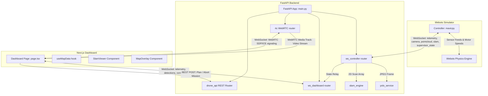

# Project Architecture Guide: Autonomous Drone Simulation

This document provides a comprehensive breakdown of the project's architecture, including file descriptions, data pipelines, key algorithms, and critical integration notes. It is designed to help developer agents understand and work on the codebase.

---

## 1. System Architecture Overview

The system consists of three main components:
1. **Webots Simulation & Controller**: Runs the physical drone simulation, processes onboard sensors (GPS, IMU, LiDAR, Camera), and commands the motors.
2. **FastAPI Backend**: Acts as the central data hub. It processes raw camera frames using YOLO, executes 2D SLAM mapping, computes autonomous flight commands, handles WebRTC stream signaling, and relays state.
3. **Next.js Dashboard**: A premium, responsive tactical dashboard providing manual control interfaces, real-time SLAM occupancy mapping, 3D point cloud rendering, live video feeds, and mission planning tools.

### Communication Architecture

---

## 2. Component Walkthrough

### 2.1 Webots Controller (`mavic/controllers/mavicpy/`)
All files run inside the Webots environment in a single process driven by the simulation step.

*   **[mavicpy.py](../mavic/controllers/mavicpy/mavicpy.py)**: The entry point. Instantiates the main `Mavic` supervisor class and calls its `run()` loop.
*   **[mavic.py](../mavic/controllers/mavicpy/mavic.py)**: The core drone control loop class. Handles device initialization (IMU, GPS, Gyro, Compass, Leds, Motors, Camera, LiDAR), stabilized camera gimbal control, manual keyboard backups, motor velocity updates, and scheduled WebSocket data updates.
*   **[ws_client.py](../mavic/controllers/mavicpy/ws_client.py)**: A thread-safe, background WebSocket client. Uses a drop-on-full queue strategy (max length 3) so that network lags never block the simulation physics engine step.
*   **[flight_control.py](../mavic/controllers/mavicpy/flight_control.py)**: Pure mathematical controller. Contains PID tuning constants and calculates the target velocity for all 4 propellers based on current vs. target altitude, attitude (roll/pitch/yaw), and velocity errors.
*   **[sensors.py](../mavic/controllers/mavicpy/sensors.py)**: Formats raw simulator values into Python-friendly JSON payloads:
    *   `capture_camera_jpeg`: converts BGRA buffers to RGB NumPy arrays and saves them as compressed JPEG strings.
    *   `get_lidar_points_with_pose`: filters out infs from the 3D LiDAR point cloud and binds it to a 6-DOF pose snapshot.
    *   `extract_slam_slice`: isolates a 2D height band relative to the drone (-5.0m to -1.0m) to generate a 1D range scan for SLAM.
    *   `read_telemetry`: snapshots GPS, IMU, Gyro, and simulation time variables.
*   **[supervisor.py](../mavic/controllers/mavicpy/supervisor.py)**: Manages simulation ground truths. Tracks up to 50 pedestrians (`PED_0` - `PED_49`), runs 3D Euclidean range checks when a YOLO hit is reported to mark pedestrians as confirmed, and spawns waypoints/flight path overlays inside Webots using VRML nodes.

### 2.2 FastAPI Backend (`backend/app/`)
Runs on standard port `8001`.

*   **[main.py](../backend/app/main.py)**: Fast API application factory. Configures CORS and hooks up the routers.
*   **[state.py](../backend/app/state.py)**: In-memory global state stores (locks, connection tracking tables, current telemetry, active flight plans, detected targets).
*   **[routers/ws_controller.py](../backend/app/routers/ws_controller.py)**: Main Webots data handler.
    *   Processes incoming telemetry and executes the **Autonomous Navigation & Return-to-Home State Machines**. If active, it computes and sends pitch, yaw, and altitude commands back to the drone.
    *   Routes image bytes through YOLO and deduplicates detected humans with a 4.0m exclusion zone.
    *   Pushes raw LiDAR scans into BreezySLAM to update the occupancy grid.
*   **[routers/ws_dashboard.py](../backend/app/routers/ws_dashboard.py)**: Manages WebSocket client sessions for UI clients. Broadcasts state updates and listens for incoming manual control commands to override the autopilot.
*   **[routers/drone_api.py](../backend/app/routers/drone_api.py)**: REST API serving camera streams (MJPEG fallback), 3D point cloud points, supervisor state, and flight path generation endpoints.
*   **[routers/rtc.py](../backend/app/routers/rtc.py)**: WebRTC camera pipeline. Provides low-latency video streaming using `aiortc`. Employs an `asyncio.Event`-based loop (`state.new_frame_event`) to stream frames immediately upon arrival.
*   **[services/yolo_service.py](../backend/app/services/yolo_service.py)**: YOLOv8 model inference engine. Classifies frames (persons, cars) and back-projects 2D image coordinates to Webots 3D global coordinates using Euler rotation matrices and camera gimbal pitch (~20° down).
*   **[slam_engine.py](../backend/app/slam_engine.py)**: Configures RMHC-SLAM (`breezyslam`) parameters (800x800 map size, 40m coverage, 0.05m/pixel resolution).

### 2.3 Next.js Dashboard (`frontend/src/`)
*   **[page.tsx](../frontend/src/app/dashboard/page.tsx)**: Assembles the dashboard. Utilizes draggable floating panels (`FloatingPanel.tsx`) containing UI modules to allow operators to arrange their screen.
*   **[hooks/useMapData.ts](../frontend/src/hooks/useMapData.ts)**: Handles the main telemetry/map WebSocket updates, filters telemetry glitches (outliers moving >18m/tick), and applies Exponential Moving Average (EMA) smoothing to the drone's position.
*   **[components/dashboard/SlamViewer.tsx](../frontend/src/components/dashboard/SlamViewer.tsx)**: Renders the BreezySLAM occupancy map from base64-encoded PNGs onto a canvas, overlaying the drone trajectory, waypoints, pedestrians, and targets.
*   **[components/dashboard/MapOverlay.tsx](../frontend/src/components/dashboard/MapOverlay.tsx)**: Tactical map implementation allowing users to define polygon coordinates to trigger autonomous flight path missions.
*   **[components/dashboard/Controls.tsx](../frontend/src/components/dashboard/Controls.tsx)**: Virtual joystick keyboard bindings to send manual pitch, roll, yaw, and altitude commands.

---

## 3. Core Autopilot & Path Planning Algorithms

### 3.1 Lawnmower Flight Path Generation
Implemented in `/api/v1/drone/plan_flight` ([drone_api.py](../backend/app/routers/drone_api.py)):
1. Receives search boundary vertices (polygon) plotted from the React frontend.
2. Uses the `shapely` geometry library to intersect horizontal sweeps spaced by a `strip_width` (meters) with the bounding polygon.
3. Generates alternating coordinate segments to construct a continuous lawnmower sweep pattern.
4. Generates a list of 3D waypoints `[X, Y, Altitude]` and pushes them to the autonomous flight state machine.

### 3.2 Autonomous Navigation State Machine
Implemented in `ws_controller.py` ([ws_controller.py](../backend/app/routers/ws_controller.py)):
- **Waypoint Navigation**: Calculates distance and heading error (bearing vs. current yaw). Commands a PID-like rotational correction (`yaw`) and moves forward (`pitch`) once aligned. Arriving within `1.5` meters of a waypoint increments the target index.
- **Return to Home (RTH)**: Commenced when waypoints are completed or aborted. Navigates back to the initial `home_x` and `home_y`.
- **Auto-Landing**: Triggers once RTH is within `1.2` meters of the home coordinates. Progressively decreases altitude until height is < `0.25` meters, then cuts motor speeds to zero.

---

## 4. CRITICAL: Global Coordinate System & Inconsistencies

Webots uses an **ENU (East-North-Up)** coordinate system for Z-up configurations. This leads to coordinate representations that agents **MUST** be aware of.

### 4.1 Global Axes Definition
- **X axis (Index 0)**: Horizontal (East-West)
- **Y axis (Index 1)**: Horizontal (North-South)
- **Z axis (Index 2)**: Vertical (Up-Down/Altitude)

### 4.2 The Coordinate Mapping Mismatch
There is an active coordinate mapping mismatch between **sensor telemetry** and the **supervisor state** in the original implementation. This will cause the drone's position on the map to glitch or jump back and forth when both streams are rendering:

1.  **Sensor Telemetry Pipeline**:
    *   `read_telemetry` (`sensors.py`) sets:
        *   `"x": x` (gps_x)
        *   `"y": y` (gps_y)
        *   `"z": z` (gps_z - altitude)
    *   The frontend page receives this and sets:
        *   `dronePos = { x: telemetry.x, y: telemetry.y }` (maps to horizontal global coordinate plane **X-Y**).
2.  **Supervisor State Pipeline**:
    *   `SupervisorManager.build_payload` (`supervisor.py`) formats the coordinates incorrectly:
        *   `"drone": {"x": drone_xyz[0], "y": drone_xyz[2]}` (maps global **X** and vertical **Z (altitude)** as the 2D plane!).
        *   `"confirmed_detections": [{"id": pid, "x": pos[0], "y": pos[2]}]` (maps global **X** and vertical **Z (height)**).
        *   `"all_pedestrians": [{"id": pid, "x": pos[0], "y": pos[2]}]` (maps global **X** and vertical **Z (height)**).
    *   The frontend receives this and sets:
        *   `dronePos = msg.drone` (maps to **X-Z**).

#### Impact
- **Drone Jumps**: When telemetry is active, the drone is rendered at `(X, Y)`. When a supervisor state update arrives, it instantly shifts to `(X, Z)` (effectively setting its visual y-map position to its altitude!).
- **Detection Placement Offset**: Detections derived from YOLO projection correctly use the horizontal plane `(X, Y)` (e.g. y = 22.66m). Supervisor-confirmed targets use the vertical plane `(X, Z)` (e.g. y = 1.37m, representing their height off the floor). This leaves supervisor-confirmed targets stranded near the map axis rather than showing up on top of the YOLO indicator.

*Recommendation for future agents: Patch `SupervisorManager.build_payload` to use `drone_xyz[1]` and `pos[1]` instead of index `2` for mapping 2D `y` values.*
